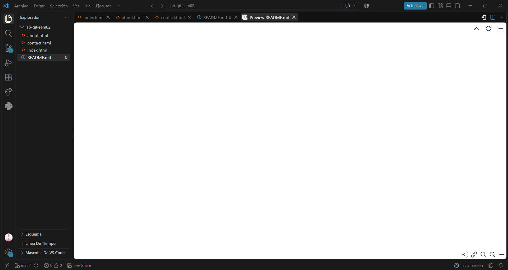
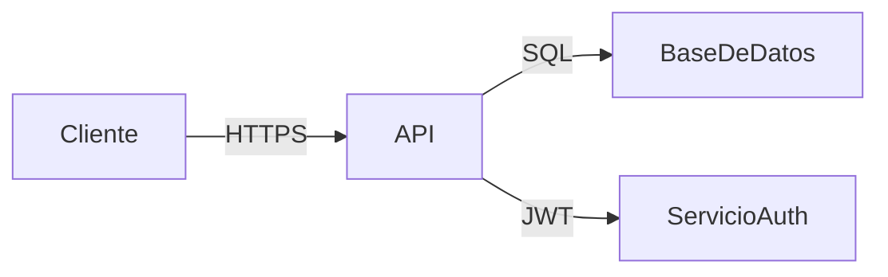
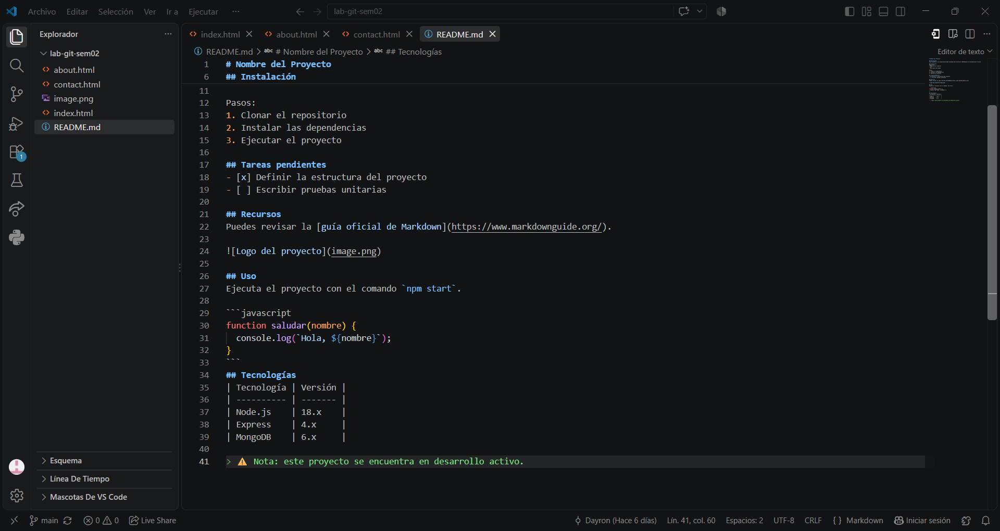

# Nombre del Proyecto


## Descripción
Este proyecto es una *aplicación web* diseñada para practicar **Markdown** en documentación técnica.

## Tabla de contenidos
- [Instalación](#instalación)
- [Tecnologías](#tecnologías)
- [Estado del proyecto](#estado-del-proyecto)
- [Arquitectura](#arquitectura)
- [Capturas](#capturas)
- [Contribuidores](#contribuidores)

## Instalación
Requisitos:
- Node.js 18 o superior
- Git
- Una cuenta de GitHub

Pasos:
1. Clonar el repositorio
2. Instalar las dependencias
3. Ejecutar el proyecto

## Tareas pendientes
- [x] Definir la estructura del proyecto
- [ ] Escribir pruebas unitarias

## Recursos
Puedes revisar la [guía oficial de Markdown](https://www.markdownguide.org/).



## Uso
Ejecuta el proyecto con el comando `npm start`.

```javascript
function saludar(nombre) {
  console.log(`Hola, ${nombre}`);
}
```

## Tecnologías

| Tecnología | Versión | Propósito          |
| ---------- | ------- | ------------------ |
| Node.js    | 18.x    | Servidor backend    |
| React      | 18.x    | Interfaz de usuario |
| MongoDB    | 6.x     | Base de datos       |

## Estado del proyecto
- [x] Autenticación de usuarios
- [x] CRUD de tareas
- [ ] Notificaciones en tiempo real
- [ ] Despliegue en producción

## Arquitectura



## Capturas


## Contribuidores
- [@Fustamante](https://github.com/Fustamante) — Desarrollo y documentación
> ⚠️ Nota: este proyecto se encuentra en desarrollo activo.